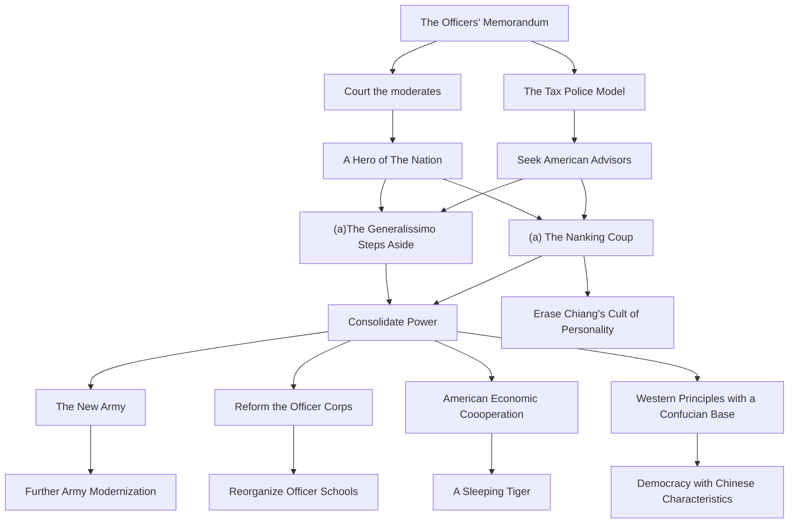

HOI4 Sun Takes power mod

```mermaid
flowchart TD
    A[The Officers' Memorandum] --> B[Court the moderates]
    A --> C[The Tax Police Model]
    B --> D[A Hero of The Nation]
    C --> E[Seek American Advisors]
    D --> F["(a)"The Generalissimo Steps Aside]
    E --> F
    D --> G["(a)" The Nanking Coup]
    E --> G
    F --> H[Consolidate Power]
    G --> H
    H --> I[The New Army]
    H --> J[Reform the Officer Corps]
    H --> K[American Economic Coooperation]
    G --> L[Erase Chiang's Cult of Personality]
    H --> P[Western Principles with a Confucian Base]
    I --> M[Further Army Modernization]
    J --> N[Reorganize Officer Schools]
    K --> O[A Sleeping Tiger]
    P --> Q[Democracy with Chinese Characteristics]


```